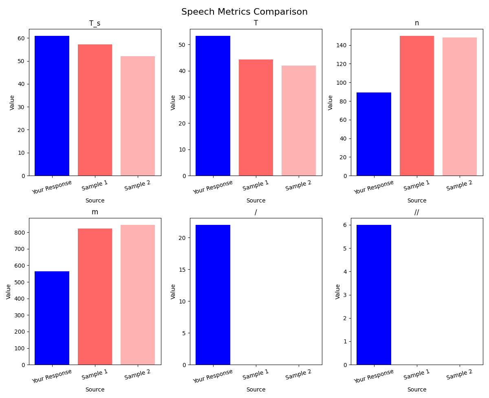

# SMA-CPFA-DSRA-PD-RDE-SPE-LSA-VPA

## Overview

**Speech Metrics Analyzer for Comprehensive Pronunciation Feature Assessment, Detailed Speech Rate Analysis, Pause Detection, Rhythm Dynamics Evaluation, and In-Depth Speech Pattern Research Tool, Designed for Language Proficiency Enhancement, Linguistic Studies, and Verbal Performance Analytics. This Tool Provides a Robust Platform for Collecting and Analyzing Key Speech Features Such as Word Likelihood, Speech Rate, Pauses, and Rhythm Variation. It is Ideal for Linguists, Researchers, Educators, and Language Learners Looking to Gain Data-Driven Insights into Speech Characteristics, Speech Fluency, and the Underlying Patterns of Spoken Language for More Effective Communication, Speech Training, and Academic Research**, or **SMA-CPFA-DSRA-PD-RDE-SPE-LSA-VPA** in short, is a comprehensive and easy-to-use tool designed to evaluate key characteristics of spoken language. This program assesses critical speech components such as pronunciation features, speech metrics, rhythm dynamics, pause detection, and speech pattern evaluation. It processes raw transcript data, providing objective and insightful metrics related to word likelihood, speech rate, pauses, and rhythm variations. Whether you are working on language proficiency, conducting linguistic research, or analyzing spoken patterns, this tool offers valuable insights into the quality of your speech with precise metrics.

### Key Features:
- **Comprehensive Pronunciation Feature Assessment (CPFA)**: Evaluates elements like word likelihood, average likelihood per second, and vowel duration.
- **Detailed Speech Rate Analysis (DSRA)**: Provides insights into speech rate, including the total duration, number of words, and syllables.
- **Pause Detection (PD)**: Detects and quantifies both short pauses ("/") and long pauses ("//") within the speech transcript.
- **Rhythm Dynamics Evaluation (RDE)**: Analyzes the rhythm of speech, looking at metrics such as variation and consistency in the pacing.
- **Speech Pattern Evaluation (SPE)**: Offers a deeper look into speech characteristics like variation in pace and emphasis.
- **Linguistic Studies & Analysis (LSA)**: Provides an overall perspective on speech from a linguistic analysis standpoint.
- **Verbal Performance Analytics (VPA)**: Measures and reports on various verbal performance metrics, allowing for improvement tracking.

## How It Works

The tool processes transcripts that contain markers for pauses, including short pauses ("/") and long pauses ("//"). It extracts various speech characteristics, calculates pronunciation features, evaluates the rhythm, and provides detailed speech metrics. The program then visualizes the data with clear and concise bar charts, allowing for direct comparison of multiple speech samples.

## Files Included:
1. **main.py**: The main program file that generates speech analysis reports.
2. **givememyreport.py**: A helper script that parses and processes the raw data to generate visual reports.
3. **sample1.mp3** and **sample2.mp3**: Example audio files that can be used for testing and comparison.

## How to Run
1. Run `python main.py` to extract a text report for your audio (audio.mp3)
2. Run `python givememyreport.py` to visualize your result in comparison to sample1 and sample2.

## Report Explanation

The generated reports are visualized in the form of bar graphs, and the following metrics are compared:

### 1. Pronunciation Features

These metrics describe how the speech is articulated:

- **L1**: Likelihood of the entire transcript (Higher values suggest better clarity of speech).
- **L2**: Average likelihood across all words (Higher values indicate more natural speech).
- **L3**: Average likelihood across all letters.
- **L4**: Average likelihood per second (Confidence in speech over time).
- **L5**: Average likelihood density across all words.
- **L6**: Normalized L4 by rate of speech.
- **L7**: Normalized L5 by rate of speech.
- **R**: Rate of speech: Letters per total duration.
- **S_v**: Average vowel duration deviations.
- **Sn_v**: Average normalized vowel duration deviations.

### 2. Speech Metrics

These relate to overall speech activity:

- **T_s**: Total speech time.
- **T**: Total time including speech and pauses.
- **n**: Total number of words.
- **m**: Total number of syllables.
- **/**: Number of short pauses (quick pauses between words).
- **//**: Number of long pauses (longer pauses between sentences).

### 3. Rhythm Metrics

These relate to the consistency and patterns in the rhythm of speech:

- **percentX**: Percentage of speech with a rhythmic pattern.
- **stddevX**: Standard deviation of rhythmic patterns.
- **varcoX**: Variance of the rhythm.
- **rpviX**: Rhythmic periodic variability index.
- **npviX**: Non-periodic variability index.

## References

1. Chen et al. "Pronunciation Features and Analysis for Language Learning." [Link to paper or article]
2. TOEFL Speaking Scoring Guide: [ETS Speaking Guide](https://www.ets.org/toefl/test-takers/speaking)
3. Speech Analysis Methods: [Speech Techniques](https://www.speech-techniques.com)

## Contact
Arthicha Srisuchinnawong
zumoarthicha@gmail.com

